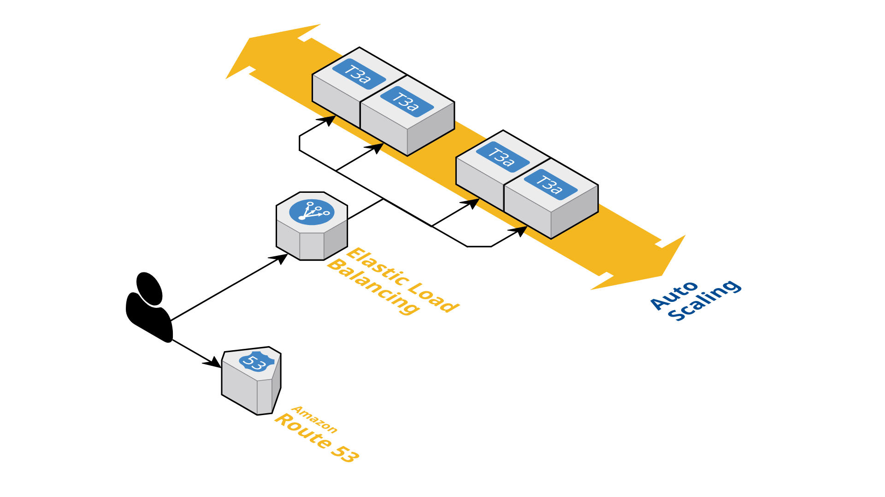

<h1 align="center">🪣 S3 Explorer & Deployment POC </h1>

---

<p align="center">
  <a href="#tooling">■ Tooling</a>&nbsp;&nbsp;
  <a href="#project-structure">■ Project Structure</a>&nbsp;&nbsp;
  <a href="#architechture">■ Architechture</a>&nbsp;&nbsp;
  <a href="#application">■ Application</a>
</p>

---

## Tooling

```
Terraform  - Infrastructure as Code
Python     - Application Development
- FastAPI  - Web Framework
- Uvicorn  - ASGI Server
- PyTest   - Testing Framework
```

#### Project Structure:

```
├── app/                    - Application source code
│   ├── .env                - Environment variables
│   ├── __init__.py         - Python package file
│   ├── app.py              - Main application file
│   ├── test_app.py         - Test suite
│   └── requirements.txt    - Python dependencies
├── infra/                  - Terraform configuration
│   ├── modules/            - Reusable modules
│   │  └── ***/main.tf      - Module configuration
│   └── main.tf             - Main configuration
└── README.md               - <-- You are here
```

---

## Architechture

[]()

The infrastructure is defined using Terraform and is composed of several modules to manage different components of the AWS environment. Below is an overview of the architecture:

- VPC:
  - The VPC module creates a Virtual Private Cloud (VPC) with a specified CIDR block and a private subnet.
  - VPC CIDR Block: 10.0.0.0/16
  - Private Subnet CIDR Block: 10.0.1.0/24

- Security Groups
  - The Security Groups module creates security groups for the application instances and the Application Load Balancer (ALB).
  - Instance Security Group: Allows inbound traffic on port 80 from the ALB security group.
  - ALB Security Group: Allows inbound traffic on port 443 from any IP.

- Application Load Balancer (ALB)
  - The ALB module sets up an Application Load Balancer to distribute incoming traffic across multiple instances.
  - ALB Name: s3-alb
  - Target Group Name: s3-tg
  - Domain Name: getmesmer.xyz

- Auto Scaling
  - The Auto Scaling module configures an Auto Scaling Group to manage the number of EC2 instances based on the load.
  - AMI ID: ami-0c55b159cbfafe1f0 (Amazon Linux 2)
  - Instance Type: t3a.small
  - Desired Capacity: 2
  - Max Size: 4
  - Min Size: 1

- ACM (AWS Certificate Manager)
  - The ACM module manages SSL/TLS certificates for the domain.
  - Domain Name: getmesmer.xyz

- Outputs
  - ALB DNS Name: The DNS name of the Application Load Balancer.
  - Certificate ARN: The ARN of the SSL/TLS certificate.

This modular approach allows for easy management and scalability of the infrastructure components. Each module is responsible for a specific part of the infrastructure, making it easier to maintain and update.

---

## Application

The application is built using FastAPI and provides endpoints to interact with an S3 bucket. Below is an overview of how the application works:

**Configuration:** The application uses environment variables to configure the S3 client. These variables are loaded from a .env file using dotenv. The required environment variables are:
```
S3_ENDPOINT: The endpoint URL for the S3 service.
S3_REGION: The AWS region where the S3 bucket is located (default: us-east-1).
S3_ACCESS_KEY: The access key for the S3 service.
S3_SECRET_KEY: The secret key for the S3 service.
S3_BUCKET_NAME: The name of the S3 bucket.
```

**S3 Client:** The application uses the boto3 library to interact with the S3 service. The S3Client class is a singleton that ensures only one S3 client instance is created. The client is configured using the environment variables.

**Endpoints:** The application provides the following endpoints:
```
GET /: Lists all available endpoints in the application.
GET /health: Returns the health status of the application.
GET /list-bucket-content: Lists the contents of the S3 bucket at the root level.
GET /list-bucket-content/{path:path}: Lists the contents of the S3 bucket at the specified path.
```

**Error & Edge Cases Handling:** The application handles errors related to S3 client operations. If a PermanentRedirect error occurs, the client is reconfigured to use the correct region. If an EndpointConnectionError occurs, a 500 HTTP error is returned. If the response from the S3 service is paginated, the application fetches all pages to return the complete list of objects.

---

Running the Application
To run the application, use the following command:
```bash
uvicorn app:app --host 0.0.0.0 --port 8000
```
This will start the FastAPI application on http://0.0.0.0:8000.

Example Usage
To list all available endpoints:
```bash
curl http://localhost:8000/
```
Example Response:
```
{
  "endpoints": [
    "/",
    "/health",
    "/list-bucket-content/{path}",
    "/list-bucket-content"
  ]
}
```
---
To check the health status:
```bash
curl http://localhost:8000/health
```
Example Response:
```
{
  "status": "healthy"
}
```
---
To list the contents of the S3 bucket at the root level:
```bash
curl http://localhost:8000/list-bucket-content
```
Example Response:
```
{
  "content": [
    "ANNOUNCEMENTS",
    "CompanyUpdates",
    "MMI_2019-10-1.csv",
    "MMI_2019-10-10.csv",
    "MMI_2019-10-11.csv"
  ]
}
```
---
To list the contents of the S3 bucket at a specific path:
```bash
curl http://localhost:8000/list-bucket-content/some/path
```
Example Response:
```
# If the path does not exist

{
  "error": "Path 'demo' does not exist in the bucket"
}

-- OR --

# If the path exists

{
  "content": [
    "3PLA",
    "63MO",
    "8KMS",
    "A2ZI",
    "AAA"
  ]
}
```
---
To run the test suite:
```bash
pytest test_app.py
```
---

## Future Improvements

- Add a CI/CD pipeline to deploy the application and infrastructure. (Jenkins/ArgoWorkflow + CodeDeploy)
- Add a monitoring and logging system to monitor the application and infrastructure.
- Add a backup and recovery system to backup the application and infrastructure.
- Add a caching mechanism to improve the performance of the application.
- Add AWS WAF to the ALB to improve the security of the application.

<h4 align="center">End 👋</h4>
